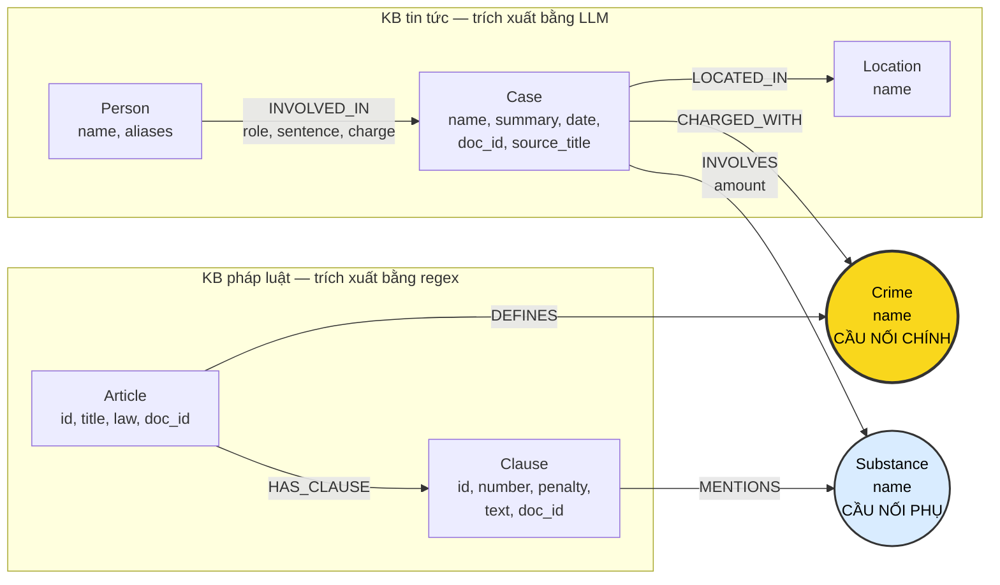

# Thiết kế Ontology — Day 19

**Họ tên:** Trần Quốc Khánh

**MSSV:** 2A202602824

**Lựa chọn** (đánh dấu một):

- [x] Dùng ontology gợi ý (có thể chỉnh nhỏ)
- [ ] Tự thiết kế (xét bonus +15, xem `SUBMISSION.md`)

Ontology này ưu tiên tính đơn giản, khả năng kiểm chứng và tương thích với bốn yêu cầu KG-1 đến KG-4. Hai KB được nối qua `Crime`; `Substance` là cầu nối phụ để tìm khoản luật theo loại chất và tổng hợp các vụ cùng liên quan đến một chất.

## 1. Sơ đồ

## 2. Entity types (node labels)

| Label | Ý nghĩa | Khóa định danh (`MERGE` theo) | Properties | Lấy từ KB nào | Trích bằng |
| --- | --- | --- | --- | --- | --- |
| `Article` | Một điều luật | `id`, ví dụ `Điều 251 BLHS` | `id`, `title`, `law`, `doc_id` | Luật | Regex và metadata |
| `Clause` | Một khoản trong điều luật | `id`, ví dụ `Điều 251 BLHS khoản 1` | `id`, `number`, `penalty`, `text`, `doc_id` | Luật | Regex |
| `Crime` | Tội danh chuẩn hóa được điều luật định nghĩa | `name` | `name` | Luật và tin | Regex từ tiêu đề luật; LLM từ tin; sau đó `normalize_crime` và `link_entity` |
| `Case` | Một vụ việc/vụ án được bài báo mô tả | `name` | `name`, `summary`, `date`, `doc_id`, `source_title` | Tin | LLM |
| `Person` | Cá nhân tham gia vụ việc | `name` | `name`, `aliases` | Tin | LLM |
| `Substance` | Chất ma túy được nhắc đến | `name` chuẩn | `name` | Luật và tin | Danh sách chuẩn + regex ở luật; LLM và đối chiếu danh sách ở tin |
| `Location` | Tỉnh/thành phố hoặc địa điểm chính của vụ việc | `name` | `name` | Tin | LLM |

`Article`, `Clause` và `Case` là các node gắn trực tiếp với một tài liệu nên bắt buộc có `doc_id = Document.id`. `Crime`, `Substance`, `Person` và `Location` có thể được nhiều tài liệu cùng tham chiếu nên được xem là node dùng chung; chúng không dùng `doc_id` làm khóa.

## 3. Relationships

| Type | Từ → Đến | Properties trên cạnh | Ý nghĩa |
| --- | --- | --- | --- |
| `DEFINES` | `Article` → `Crime` | Không | Điều luật định nghĩa tội danh |
| `HAS_CLAUSE` | `Article` → `Clause` | Không | Điều luật gồm các khoản |
| `MENTIONS` | `Clause` → `Substance` | Không | Khoản luật nhắc đến chất ma túy này |
| `CHARGED_WITH` | `Case` → `Crime` | Không | Vụ việc liên quan đến/tố tụng về tội danh chuẩn hóa |
| `INVOLVES` | `Case` → `Substance` | `amount` | Vụ việc có chất ma túy và khối lượng được bài báo nêu |
| `LOCATED_IN` | `Case` → `Location` | Không | Địa điểm chính của vụ việc |
| `INVOLVED_IN` | `Person` → `Case` | `role`, `sentence`, `charge` | Vai trò, mức án và tội danh riêng của một người trong vụ việc |

Hướng cạnh được chọn theo chiều đọc tự nhiên từ nguồn thông tin đến đối tượng được mô tả. Khi truy vấn khám phá, Cypher vẫn có thể dùng cạnh vô hướng `-[r]-`; khi trả lời theo ngữ nghĩa, truy vấn dùng đúng chiều ở bảng trên.

## 4. Node cầu nối giữa 2 KB

- **Node chính:** `Crime`.
- **Vì sao chọn:** phía luật có `(Article)-[:DEFINES]->(Crime)`, còn phía tin có `(Case)-[:CHARGED_WITH]->(Crime)`. Vì vậy có thể đi từ một người/vụ trong tin sang đúng điều luật và các khoản hình phạt. Đây là đường nối cần thiết cho Q3, Q4 và Q5.
- **Cầu nối phụ:** `Substance`. Cả khoản luật và vụ án đều có thể nhắc cùng chất, tạo đường `(Case)-[:INVOLVES]->(Substance)<-[:MENTIONS]-(Clause)`. Cầu phụ giúp chọn khoản có điều kiện định lượng trong Q5 và tìm mọi vụ liên quan đến MDMA trong Q6.
- **Cách đảm bảo hai phía khớp tên:** tội danh từ tiêu đề luật được chuẩn hóa bằng `normalize_crime`; prompt trích xuất tin chỉ cho phép chọn từ danh sách tội danh chuẩn; kết quả LLM vẫn được đưa qua `link_entity`, ưu tiên khớp chính xác sau chuẩn hóa rồi mới fuzzy match với ngưỡng `0.8`. Chất ma túy dùng danh sách tên chuẩn `SUBSTANCES` trong cả regex và prompt.
- **Khi cầu gãy:** cầu `Crime` gãy khi bài báo không nêu tội danh, LLM trả JSON sai, tên tội không thuộc danh sách luật hoặc fuzzy match không đạt ngưỡng. Cầu `Substance` gãy khi dùng biệt danh như “thuốc lắc”, tên mới ngoài danh sách, hoặc LLM bỏ sót chất/khối lượng. Cách xử lý là không nối đoán; ghi log các mention không khớp, bổ sung alias/danh sách chuẩn, thử trích xuất lại và kiểm tra bằng Cypher tìm `Case` không có `CHARGED_WITH` hoặc `INVOLVES`.

## 5. Competency questions

| Câu | Đường đi (Cypher pattern) | Cách lấy dữ kiện | Trả lời được? |
| --- | --- | --- | --- |
| Q1 | `(a:Article {id:'Điều 2 Luật PCMT'})-[:HAS_CLAUSE]->(cl:Clause {number:4})` | Vector search tạo seed từ tài liệu luật; lấy `cl.text` chứa định nghĩa “tiền chất”. | Có |
| Q2 | `(p:Person)-[r:INVOLVED_IN]->(k:Case)` | Chọn vụ có tiêu đề/tóm tắt chứa “hơn 36kg” và ngày xét xử 28-9; lọc `r.sentence = 'tử hình'`; trả `p.name`. | Có |
| Q3 | `(p:Person {name:'Lê Minh Thành'})-[r:INVOLVED_IN]->(k:Case)-[:CHARGED_WITH]->(c:Crime)<-[:DEFINES]-(a:Article)-[:HAS_CLAUSE]->(cl:Clause {number:1})` | Lấy `r.sentence`, `r.charge`/`c.name`, `a.id` và `cl.penalty`. | Có |
| Q4 | `(p:Person)-[:INVOLVED_IN]->(k:Case)-[:CHARGED_WITH]->(c:Crime)<-[:DEFINES]-(a:Article)-[:HAS_CLAUSE]->(cl:Clause)` | Tìm `p.name = 'Dương Minh Tuấn'` hoặc alias “Hoàng Nato”; lấy tội từ `c`, Điều từ `a`, rồi xét các khoản của Điều 255 và chọn khung chính cao nhất (`cl.number = 4`). | Có |
| Q5 | `(p:Person {name:'Cái Quang Huy'})-[:INVOLVED_IN]->(k:Case)-[iv:INVOLVES]->(s:Substance {name:'MDMA'})<-[:MENTIONS]-(cl:Clause)<-[:HAS_CLAUSE]-(a:Article)-[:DEFINES]->(c:Crime)<-[:CHARGED_WITH]-(k)` | Lấy tội, chất và `iv.amount` từ vụ; chỉ giữ điều luật cùng `Crime`; đối chiếu 9,6kg MDMA với nội dung khoản để chọn khoản 4 Điều 250, rồi lấy `cl.penalty`. | Có, nhưng việc so sánh đơn vị/khối lượng cần logic trong `context()` hoặc LLM đọc `cl.text`. |
| Q6 | `(s:Substance {name:'MDMA'})<-[:INVOLVES]-(k:Case)<-[:INVOLVED_IN]-(p:Person)` | Gom `DISTINCT k`, đọc `k.name`/`k.summary`, và lấy người đại diện nếu cần để liệt kê các vụ. | Có |

Các pattern trên mô tả đường đi logic. Trong `Neo4jGraph.context`, seed còn được tạo từ `doc_id` của kết quả vector search và từ `name`/`aliases` xuất hiện trực tiếp trong câu hỏi; sau đó mới mở rộng theo các đường đi này.

## 6. Quyết định thiết kế và đánh đổi

1. **Chọn `Crime` làm node riêng và là cầu nối chính.** Phương án khác là lưu tội danh như chuỗi trên `Case`. Node riêng cho phép nhiều vụ cùng nối đến một định nghĩa pháp lý và hỗ trợ multi-hop sang `Article`; đổi lại phải chuẩn hóa tên cẩn thận để tránh cầu gãy hoặc tạo hai node cùng nghĩa.
2. **Tách `Article` và `Clause`.** Phương án khác là lưu toàn bộ điều luật trong một node hoặc tạo thêm node tới cấp `Point`. Tách tới `Clause` đủ để trả lời khung hình phạt theo khoản trong Q3–Q5 mà graph chưa quá lớn; đổi lại điều kiện chi tiết ở cấp điểm vẫn nằm trong `Clause.text`, nên so sánh định lượng chưa hoàn toàn có cấu trúc.
3. **Dùng regex cho luật và LLM cho tin tức.** Phương án khác là dùng LLM cho cả hai nguồn. Regex ổn định, rẻ và tái lập được vì văn bản luật có cấu trúc đều; LLM phù hợp hơn với văn xuôi báo chí nhưng có thể bỏ sót hoặc sinh JSON sai, do đó cần danh sách chuẩn và bước liên kết lại bằng code.
4. **Lưu mức án trên cạnh `Person`–`Case`.** Phương án khác là đặt `sentence` trên `Person` hoặc tạo node `Sentence`. Cùng một người có thể tham gia nhiều vụ với kết quả khác nhau, nên mức án thuộc về quan hệ tham gia; cách này trả lời Q2–Q3 trực tiếp nhưng chưa mô hình hóa chi tiết loại bản án, cấp xét xử và ngày tuyên án.
5. **Dùng `Case.name` làm khóa cho baseline.** Phương án khác là dùng `doc_id` hoặc một mã vụ án ổn định. Tên vụ giúp đọc graph dễ và có thể gộp thông tin cùng vụ, nhưng tên do LLM đặt có nguy cơ không ổn định hoặc gộp nhầm; đây là đánh đổi chấp nhận cho ontology gợi ý và cần kiểm tra trùng lặp sau khi build.

## 7. So với ontology gợi ý

Không áp dụng vì bài chọn dùng ontology gợi ý và không đăng ký xét bonus tự thiết kế. Phần triển khai phải giữ đúng các label, relationship và property đã mô tả ở trên.

## 8. Hạn chế còn lại

- `Case.name` và `Person.name` do LLM trích xuất nên có thể tạo node trùng hoặc gộp nhầm hai thực thể cùng tên.
- Alias chất ma túy chưa được mô hình hóa; ví dụ “thuốc lắc” có thể không tự động gộp vào `MDMA` nếu bước trích xuất không chuẩn hóa đúng.
- Ngưỡng khối lượng và đơn vị vẫn nằm trong `Clause.text`, còn khối lượng vụ án là chuỗi trên `INVOLVES.amount`. Q5 vì thế phụ thuộc vào việc chuẩn hóa đơn vị hoặc khả năng suy luận của LLM, chưa phải một phép so sánh số hoàn toàn bằng Cypher.
- Chưa mô hình hóa các điểm `a`, `b`, … thành node riêng và chưa tách hình phạt bổ sung ở khoản cuối khỏi khung hình phạt chính.
- Chưa phân biệt rõ các giai đoạn tố tụng như bắt, khởi tố, truy tố, sơ thẩm và phúc thẩm; `CHARGED_WITH` đang gom nhiều trạng thái pháp lý.
- `Location` chỉ lưu tên nên có thể trùng tên hoặc thiếu phân cấp phường/quận/tỉnh.
- Một bài báo không mô tả vụ việc cụ thể hoặc không nêu tội danh sẽ không tạo được đầy đủ đường nối xuyên hai KB.
